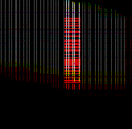
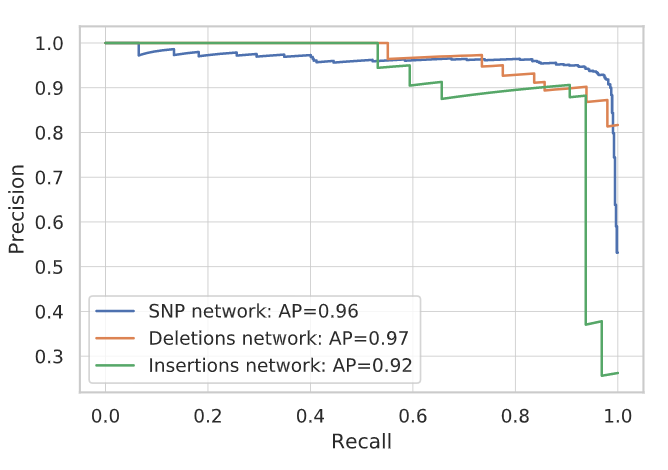
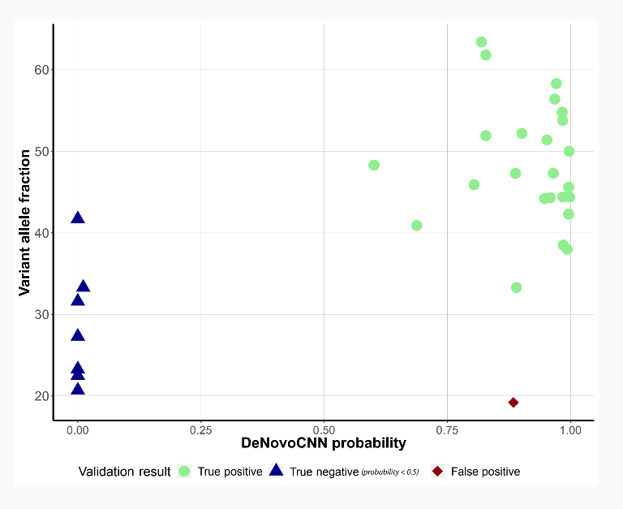
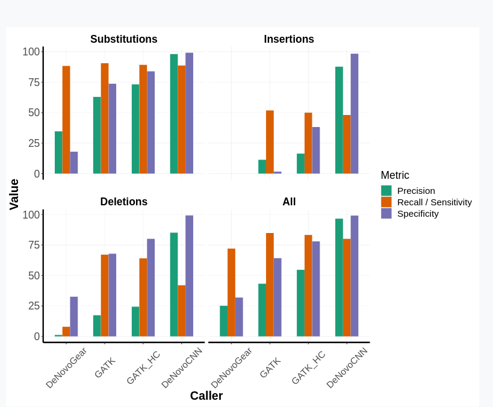

# denovoCNN

A deep learning approach to call de novo mutations (DNMs) on whole-exome (WES) and whole-genome sequencing (WGS) data. denovoCNN uses trio BAM + VCF files to generate image-like genomic sequence representations and detect DNMs with high accuracy.<br>
denovoCNN is a combination of three models for the calling of substitution, deletion and insertion DNMs. It is trained on ~16k manually curated DNM and non-DNM variant sequencing data, generated using [Illumina](https://www.illumina.com/) sequencer and [Sureselect Human
All Exon V5](https://www.agilent.com/cs/library/datasheets/public/AllExondatasheet-5990-9857EN.pdf) capture kit. Based on the current dataset size, denovoCNN uses vanilla CNN model in order to allow training and inference without requiring a GPU. More advanced models using squeeze-excitation blocks is currently in validation.<br>
denovCNN uses recallibrated BAM + VCF files and returns a tab-separated file with chromosome | start | end | reference | ref | var | DNM posterior probability | mean coverage | . A good value for filtering  is 0.85.

## How does it work?
denovoCNN reads BAM files and iterates through potential DNM locations using the input VCF files to generate snapshots of genomic regions. It stacks trio BAM files to generate and RGB image representation and uses a convolutional neural network to classify each image as either DNM or non-DNM.<br>
Images are similar to the one that you see below. Each color represents different trio individuals: red - child; green - father; blue - mother. In the example you can see a clear red signal (child reads) in the central position which in this case is a de novo deletion.<br>




## Performance
<b><i>Performance on WES data</b></i><br>
During initial training with 80/20 training/validation split, denovoCNN achieved average validation accuracies of 97.86%, 97.15% and 97.35% with categorical cross-entropy losses of 0.0855, 0.1486, 0.1053 for substitutions, insertions and deletions, respectively.



<b><i> Performance on WGS data </b></i><br>
Although the denovoCNN model was trained on WES data, there is in principle no reason the model would not also work for whole genome sequencing (WGS) data. We applied denovoCNN to 5 WGS trios sequenced to an average of 40x coverage. denovoCNN called a total of 434 DNMs with a mean of 86.8±21.7 DNM calls per trio. All of the DNM calls were inspected in IGV and were classified as either DNMs, uncertain or false positive calls. We selected a random set of 27 potential DNMs identified in coding, intergenic and intragenic regions for validation by Sanger sequencing, and an additional 5 variants that were classified as likely inherited (denovoCNN probability <0.5). DenovoCNN correctly classified all but one variant, which turned out to be FP after Sanger validation. PCR failed for a single variant which was excluded from the analysis.



<b><i>Genome in a Bottle data</b></i><br>
For additional comparisons we decided to use the extensively validated Ashkenazim Trio from the Genome in a Bottle (GIAB) consortium. We compared our results to DeNovoGear, GATK, and to GATK filtered for high confidence DNM calls (GATK_HC). DeNovoCNN scored better on all metrics compared to DeNovoGear. In comparison to GATK and GATK_HC, DeNovoCNN performed significantly better in terms of positive predictive value (a.k.a. precision; all variants: GATK:42.84, GATK_HC:54.47 versus DeNovoCNN:96.68) and specificity (GATK:64.2; GATK_HC:78.0; versus DeNovoCNN:99.13). However, deNovoCNN scored slightly lower in terms of sensitivity (a.k.a. Recall, all variants: GATK:84.88; GATK_HC:83.22 versus DeNovoCNN:80.1).



## Requirements

[Bcftools 1.8](https://samtools.github.io/bcftools/)
[bgzip 1.4.1](http://www.htslib.org/doc/bgzip.html)
[tabix 0.2.6](http://www.htslib.org/doc/tabix.html)

Python 3.5  
Tensorflow 1.10.0  
Keras 2.2.2  
Pysam  0.8.4  
Pandas 0.22.0  
Pillow 5.2.0  
Opencv 3.4.2 

## Installation
Easiest way of installing is creating an [Anaconda](https://www.anaconda.com/) environment. Dockerized version coming up.

```bash
#Create environment 
conda create -n denovocnn python=3.5

#Activate environment 
conda activate denovocnn

#Install bcftools and tabix+bgzip (single package) 
conda install -c bioconda bcftools
conda install -c bioconda tabix

#Install Python libraries
conda install -c conda-forge tensorflow=1.10.0
conda install -c conda-forge keras=2.2.2
conda install -c bioconda pysam
conda install -c anaconda pandas
conda install -c anaconda pillow
conda install -c conda-forge opencv
```

## Usage

### Training
You can train your own network by passing tab-separated files with the following columns:
<ul>
    <li><b>Chromosome</b> - variant chromsome.</li>
    <li><b>Start position</b> - variant start position.</li>
    <li><b>End position</b> - variant end position.</li>
    <li><b>End position</b> - variant end position.</li>
    <li><b>Reference</b> - reference allele.</li>
    <li><b>Variant</b> - variant allele.</li>
    <li><b>De novo assessment</b> - variant inheritance type. Use MV, PV, PV MV, PATERNAL, MATERNAL or SHARED for inherited variants and DNM for <i>de novo</i> mutations.</li>
    <li><b>Child</b> - path to child's BAM file for this variant.</li>
    <li><b>Father</b> - path to fagther's BAM file for this variant.</li>
    <li><b>Mother</b> - path to mother's BAM file for this variant.</li>
</ul>

```bash
KERAS_BACKEND=tensorflow python main.py \
--mode=train \
--build-dataset \
--genome=<PATH_TO_GENOME_FASTA_FILE> \
--train-dataset=<PATH_TO_TRAINING_DATASET_TSV> \
--val-dataset=<PATH_TO_VALIDATION_DATASET_TSV> \
--images=<PATH_TO_FOLDER_SAVING_IMAGES> \
--dataset-name=<DATASET_NAME>

```

### Prediction
To use the pretrained models, you can download them separately:
- [Substitution model](https://www.dropbox.com/s/c5lwmq7ubqj2jpy/snp.advanced_model.45.h5?dl=0)
- [Deletion model](https://www.dropbox.com/s/oxdbvns6vjjxo09/deletions.advanced_model.45.h5?dl=0)
- [Insertion model](https://www.dropbox.com/s/3hdv7ti4xg97lmi/insertions.advanced_model.45.h5?dl=0)

<b>Important: denovoCNN expects recallibrated BAM files using BQSR, more [here](https://gatk.broadinstitute.org/hc/en-us/articles/360035890531-Base-Quality-Score-Recalibration-BQSR-).</b> VCF files can be generated using your preffered variant caller.<br>
*If you're running denovoCNN on WGS data, it is recommended to split the VCF files into 10 or more parts and run each of them separately.


```bash
./predict.sh \
-w <WORKING_DIRECTORY> \
-cv <CHILD_VCF> \
-fv <FATHER_VCF> \
-mv <MOTHER_VCF> \
-cb <CHILD_BAM> \
-fb <FATHER_BAM> \
-mb <MOTHER_BAM> \
-sm <SNP_MODEL> \
-im <INSERTION_MODEL> \
-dm <DELETION_MODEL> \
-g <REFERENCE_GENOME> \
-m <MODE> \
-o <OUTPUT_FILE_NAME>
```
OR
```bash
KERAS_BACKEND=tensorflow python main.py \
--mode=predict \
--genome=<PATH_TO_GENOME_FASTA_FILE> \
--child-bam=<PATH_TO_FATHER_BAM> \
--father-bam=<PATH_TO_FATHER_BAM> \
--mother-bam=<PATH_TO_MOTHER_BAM> \
--intersected=<PATH_TO_INTERSECTED_FILE> \
--mother-bam=<PATH_TO_MOTHER_BAM> \
--snp-model=<PATH_TO_SNP_MODEL> \
--in-model=<PATH_TO_INSERTION_MODEL> \
--del-model=<PATH_TO_DELETION_MODEL>
```

<b><MODE>=genome</b> separates the variants into parts and creates a sbatch job files for each part.
<b><MODE>=exome</b> runs the tool for all found variants.
     
## Contributing
Pull requests are welcome. For major changes, please open an issue first to discuss what you would like to change.

Please make sure to update tests as appropriate.

## License
[GNU GPLv3](https://choosealicense.com/licenses/gpl-3.0/)
